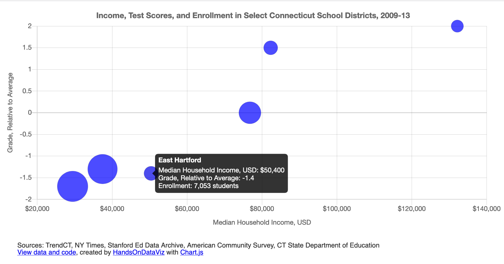

# Bubble Chart with One Series in Chart.js



## Demo 
https://repiacom.github.io/Hands-On_chartjs-bubble/

Sample data by TrendCT, NY Times, Stanford Ed Data Archive, American Community Survey,
and CT State Department of Education.

## Create your own
See chapter 10: Chart.js and Highcharts templates in [Hands-On Data Visualization](https://handsondataviz.org) by Jack Dougherty and Ilya Ilyankou.

`data.csv` needs to contain 4 columns: x-values, y-values, radius, and name of each data point.

In `script.js`, you can customize the values of variables shown in the code snippet below. For more customization, see [Chart.js documentation](https://www.chartjs.org/docs/latest/).

```javascript
var TITLE = 'Income, Test Scores, and Enrollment in Select \
  Connecticut School Districts, 2009-13';

var POINT_X = 'income'; // column name for x values in data.csv
var POINT_X_PREFIX = '$'; // prefix for x values, eg '$'
var POINT_X_POSTFIX = ''; // postfix for x values, eg '%'

var POINT_Y = 'grades'; // column name for y values in data.csv
var POINT_Y_PREFIX = ''; // prefix for x values, eg 'USD '
var POINT_Y_POSTFIX = ''; // postfix for x values, eg ' kg'

var POINT_R = 'enrollment'; // column name for radius in data.csv
var POINT_R_DESCRIPTION = 'Enrollment'; // description of radius value
var POINT_R_PREFIX = ''; // prefix for radius values, eg 'USD '
var POINT_R_POSTFIX = ' students'; // postfix for radius values, eg ' kg'
var R_DENOMINATOR = 800;  // use this to scale the dot sizes, or set to 1
                          // if your dataset contains precise radius values

var POINT_NAME = 'district'; // point names that appear in tooltip
var POINT_COLOR = 'rgba(0,0,255,0.7)'; // eg `black` or `rgba(10,100,44,0.8)`

var X_AXIS = 'Median Household Income, USD'; // x-axis label, label in tooltip
var Y_AXIS = 'Grade, Relative to Average'; // y-axis label, label in tooltip

var SHOW_GRID = true; // `true` to show the grid, `false` to hide
```

## Why am I not seeing my chart when I open `index.html` in the browser?
This error is known as cross-origin request error. When you double-click the file to open locally in your browser, you will see the URL in the address bar starting with `file:`, and all attempts to read a local CSV file, even though it is located in the same folder, will fail.

Here are a few ideas how to go around it:
* Find out how to disable same-origin policy in your browser (to start with, see [this blog post](https://alfilatov.com/posts/run-chrome-without-cors/) or [this StackOverflow thread](https://stackoverflow.com/questions/3102819/disable-same-origin-policy-in-chrome)).
* Install a program that will emulate a local server on your device, such as `live-server`(https://www.npmjs.com/package/live-server).
* Move your CSV files to a remote location on the web (such as GitHub Gist, AWS S3, or a Wordpress site),
and in `script.js`, change `$.get('./data.csv', function(csvString) {` to `$.get('https://wherever.your/file/is/data.csv', function(csvString) {`.
* Do all the development (file modifications) within GitHub without downloading this repository, using either GitHub's web interface, or GitHub Desktop application.

## See other chart templates
* Chart.js Bar Chart: https://github.com/HandsOnDataViz/chartjs-bar
* Chart.js Bar Chart with Error Bars: https://github.com/HandsOnDataViz/chartjs-error-bars
* Chart.js Line Chart: https://github.com/HandsOnDataViz/chartjs-line
* Chart.js Scatter Chart: https://github.com/HandsOnDataViz/chartjs-scatter
* Highcharts Annotated Line Chart: https://github.com/HandsOnDataViz/highcharts-line-annotated
